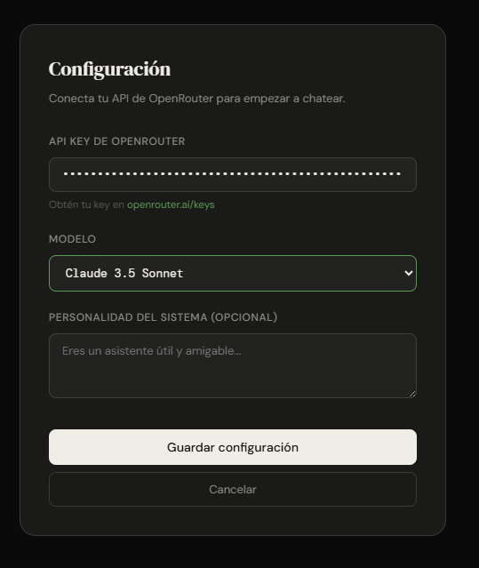
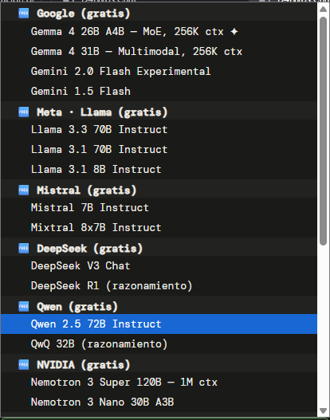
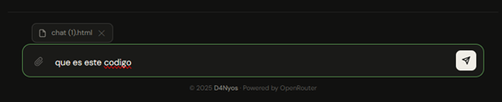

# 💬 D4Nyos Chat - OpenRouter AI Interface

 &nbsp;  &nbsp;  &nbsp; 

## 📖 Descripción General
**D4Nyos Chat** es una interfaz web ligera, elegante y **sin dependencias** (Vanilla JS/CSS/HTML) diseñada para interactuar con múltiples modelos de Inteligencia Artificial (LLMs) a través de la API de **OpenRouter**. 

El proyecto nace con la necesidad de tener un cliente de chat local, rápido y privado que permita cambiar entre modelos líderes (Claude 3.5, GPT-4o, Gemini, Llama) sin depender de plataformas de terceros que guarden el historial.

---

## 📸 Previsualización de la Interfaz

Aquí puedes ver el diseño de la aplicación en funcionamiento:

### Interfaz Principal y Chat


### Selector de Modelos y Configuración


### Panel de Adjuntos y Funcionalidad


---

## ✨ Características Principales

* **Zero Dependencies:** Construido íntegramente con HTML5, CSS3 y Vanilla JavaScript puro. Sin React, sin Vue, sin pesados *node_modules*.
* **Soporte Multimodal (Visión):** Capacidad para adjuntar imágenes y documentos. El chat detecta automáticamente si el modelo seleccionado soporta capacidades de visión (ej. Gemini Flash, GPT-4o) y avisa al usuario si no es así.
* **Almacenamiento Local (Privacy First):** Las claves API y la configuración se guardan exclusivamente en el `localStorage` del navegador del usuario. Nunca se envían a un servidor intermedio.
* **Selector Dinámico de Modelos:** Integración con docenas de modelos gratuitos y de pago de OpenRouter, con opción a inyectar IDs de modelos personalizados y *System Prompts*.
* **UI/UX Premium:** Diseño minimalista responsivo, soporte nativo para *Dark Mode* basado en las preferencias del sistema, e inyección de Markdown/Code Blocks.

## 🚀 Instalación y Despliegue

Al ser una aplicación web estática (Vanilla), no requiere compilación ni servidores backend complejos.

1.  **Clonar el repositorio:**
    ```bash
    git clone [https://github.com/d4nysj/d4nyos-chat.git](https://github.com/d4nysj/d4nyos-chat.git)
    ```
2.  **Ejecutar localmente:**
    Simplemente haz doble clic en el archivo `index.html` para abrirlo en cualquier navegador web moderno (Chrome, Firefox, Safari, Edge).
3.  **Configurar la API:**
    * Consigue tu API Key gratuita en [OpenRouter.ai](https://openrouter.ai/).
    * Abre el panel de configuración (⚙️) en la esquina superior derecha del chat.
    * Pega tu API Key, selecciona un modelo y ¡listo!
